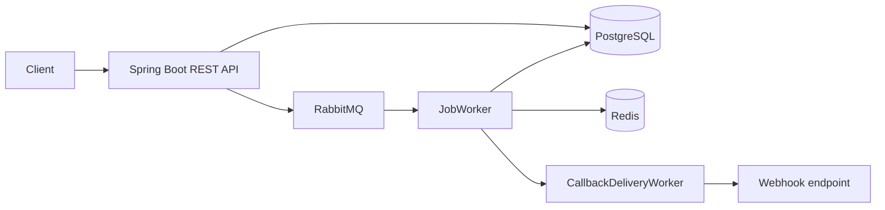

# QueuePilot

QueuePilot is a locally developed Java/Spring Boot portfolio project for running asynchronous
jobs with PostgreSQL, RabbitMQ, and Redis. It demonstrates a durable job lifecycle, worker
processing, tenant-aware API access, retries, leases, dead-letter handling, and callback
delivery without claiming production usage, production readiness, or performance results.

## Problem

Applications often need to accept work quickly and execute it outside the request/response
path. A useful job system must persist the requested work, distribute it to workers, make
failures visible, avoid duplicate requests, and provide a way to inspect or replay failed jobs.
QueuePilot implements those concerns as a single local system that can be studied and run with
Docker Compose.

## Architecture



- **PostgreSQL** is the source of truth for tenants, job definitions, executions, attempts,
  leases, schedules, dead letters, webhooks, and callback logs.
- **RabbitMQ** distributes execution and callback messages. Job messages are manually
  acknowledged after the worker records the outcome.
- **Redis** provides the shared concurrency-permit implementation used by the worker layer.
- **Spring Boot** exposes the API, schedules recovery/monitoring tasks, and hosts workers in
  the same locally runnable application.

## Execution flow

1. An authenticated client submits an execution with a tenant ID, job definition ID, parameters,
   and optional idempotency key.
2. QueuePilot validates the tenant-scoped job definition and persists a `PENDING` execution.
3. The execution is published to RabbitMQ.
4. `JobWorker` loads the execution, claims it, and records a worker lease.
5. The registered executor runs the job. The included `echo` executor returns its input.
6. QueuePilot records an execution attempt and transitions the execution to `SUCCEEDED`,
   schedules a retry, or moves it to `DEAD_LETTERED`.
7. Successful executions can publish callback work for active tenant webhooks.

RabbitMQ delivery is at least once. The database state and execution lifecycle are designed
around possible redelivery; this project does not claim exactly-once processing.

## Implemented components

- REST controllers for job definitions, executions, schedules, dead letters, and webhooks
- PostgreSQL schema managed by Flyway
- Idempotency lookup plus a database uniqueness constraint scoped by tenant
- Manual RabbitMQ acknowledgement and worker dispatch
- Worker leases with expiry/recovery support
- Exponential retry backoff with maximum attempts and execution age limits
- Dead-letter inspection and replay endpoints
- HMAC-signed callback messages for active webhooks
- Redis-backed concurrency-permit implementation
- API-key authentication with tenant-header validation
- Actuator health/metrics endpoints and structured application logging
- OpenAPI documentation through Springdoc

The included `EchoJobExecutor` is the concrete job type used for local verification. Additional
job types can implement the `JobExecutor` interface.

## Technology stack

| Area | Technology |
| --- | --- |
| Language/runtime | Java 17 |
| API/application | Spring Boot 3.4, Spring MVC, Spring Data JPA |
| Database | PostgreSQL 15, Flyway |
| Messaging | RabbitMQ 3.12, Spring AMQP |
| Shared coordination | Redis 7 |
| Build | Gradle wrapper |
| Testing | JUnit 5, Mockito, Spring test dependencies |
| Observability | Spring Actuator, Micrometer Prometheus registry, structured logging |
| Documentation | Springdoc OpenAPI |
| Local runtime | Docker Compose |

## Authentication and tenant model

Protected API routes require:

```http
Authorization: Bearer <tenant-api-key>
X-Tenant-ID: <tenant-uuid>
```

The API key is stored as a SHA-256 hash. If `X-Tenant-ID` is present, it must match the tenant
resolved from the key. Repository and service operations use tenant-scoped queries where
applicable. QueuePilot does not include a public tenant-provisioning endpoint; a local developer
must create a tenant through a controlled database/bootstrap step and keep the raw API key
outside the repository.

Health endpoints are available without API-key authentication:

- `GET /api/actuator/health`
- `GET /api/actuator/health/liveness`
- `GET /api/actuator/health/readiness`

Swagger UI and the OpenAPI document are also exposed locally:

- `GET /api/swagger-ui.html`
- `GET /api/openapi`

## API endpoints

All paths below are relative to `http://localhost:8080/api` and protected routes require the
authentication headers above.

| Method | Path | Purpose |
| --- | --- | --- |
| `POST` | `/job-definitions` | Register a tenant-scoped job definition |
| `GET` | `/job-definitions` | List active job definitions |
| `GET` | `/job-definitions/{id}` | Get a job definition |
| `DELETE` | `/job-definitions/{id}` | Deactivate a job definition |
| `POST` | `/executions` | Enqueue an execution |
| `GET` | `/executions` | List tenant executions |
| `GET` | `/executions/{id}` | Get an execution |
| `POST` | `/executions/{id}/cancel` | Cancel a pending execution |
| `POST` | `/schedules` | Create a schedule |
| `GET` | `/schedules` | List active schedules |
| `DELETE` | `/schedules/{id}` | Deactivate a schedule |
| `GET` | `/dead-letters` | List unreplayed dead letters |
| `GET` | `/dead-letters/{id}` | Get a dead letter |
| `POST` | `/dead-letters/{id}/replay` | Replay a dead-lettered execution |
| `POST` | `/webhooks` | Register a callback endpoint |
| `GET` | `/webhooks` | List tenant webhooks |
| `DELETE` | `/webhooks/{id}` | Deactivate a webhook |

## Local setup with Docker Compose

Prerequisites:

- Docker Desktop with Compose
- Java 17 only if running Gradle directly on the host

Start the complete local stack:

```bash
docker compose up -d --build
docker compose ps
```

The application waits for healthy PostgreSQL, RabbitMQ, and Redis services before starting.
The default development credentials are intentionally local-only convenience values and can be
overridden with environment variables. Do not use them for a public deployment.

Stop the stack:

```bash
docker compose down
```

To remove local database, broker, and Redis volumes as well:

```bash
docker compose down -v
```

### Environment variables

| Variable | Compose default | Purpose |
| --- | --- | --- |
| `POSTGRES_DB` | `queuepilot` | PostgreSQL database name |
| `POSTGRES_USER` | `queuepilot_dev` | PostgreSQL user |
| `POSTGRES_PASSWORD` | `dev_password` | Local PostgreSQL password |
| `RABBITMQ_USER` | `guest` | RabbitMQ user |
| `RABBITMQ_PASSWORD` | `guest` | RabbitMQ password |
| `DATABASE_URL` | Derived in Compose | Spring datasource URL |
| `DATABASE_USER` | Derived in Compose | Spring datasource user |
| `DATABASE_PASSWORD` | Derived in Compose | Spring datasource password |
| `RABBITMQ_HOST` | `localhost` outside Compose | RabbitMQ host |
| `REDIS_HOST` | `localhost` outside Compose | Redis host |

`application.yml` also supports `DATABASE_URL`, `DATABASE_USER`, `DATABASE_PASSWORD`,
`RABBITMQ_HOST`, `RABBITMQ_PORT`, `RABBITMQ_USER`, `RABBITMQ_PASSWORD`, `REDIS_HOST`, and
`REDIS_PORT` for host-based development.

## Example API requests

The examples use placeholders rather than real local credentials or identifiers.

Create a job definition:

```bash
curl -X POST http://localhost:8080/api/job-definitions \
  -H "Authorization: Bearer <tenant-api-key>" \
  -H "X-Tenant-ID: <tenant-uuid>" \
  -H "Content-Type: application/json" \
  -d '{"name":"echo","version":1,"description":"Echo input parameters"}'
```

Enqueue an execution:

```bash
curl -X POST http://localhost:8080/api/executions \
  -H "Authorization: Bearer <tenant-api-key>" \
  -H "X-Tenant-ID: <tenant-uuid>" \
  -H "Content-Type: application/json" \
  -d '{"jobId":"<job-definition-uuid>","params":{"message":"Hello QueuePilot"},"idempotencyKey":"example-1"}'
```

Fetch the execution:

```bash
curl http://localhost:8080/api/executions/<execution-uuid> \
  -H "Authorization: Bearer <tenant-api-key>" \
  -H "X-Tenant-ID: <tenant-uuid>"
```

After RabbitMQ delivery and worker execution, a locally verified response has this shape:

```json
{
  "status": "SUCCEEDED",
  "attemptCount": 1,
  "resultJson": {
    "message": "Hello QueuePilot"
  }
}
```

The UUIDs, API key, and other identifiers above are placeholders. No local test credentials or
tenant identifiers are stored in this repository.

## Testing

Run the unit/service test suite with Java 17:

```bash
./gradlew clean build --no-daemon
./gradlew test --no-daemon
```

The complete Docker Compose flow has also been verified locally with PostgreSQL 15, RabbitMQ
3.12, Redis 7, and the QueuePilot application. That verification covered tenant setup, `echo`
job registration, message delivery, worker execution, attempt persistence, transition to
`SUCCEEDED`, and result persistence. It was local validation only; no production usage or
performance metrics are claimed.

## Project structure

```text
src/main/java/com/sanyabhasin/queuepilot/
├── config/       HTTP, authentication, and RabbitMQ configuration
├── controller/   REST API endpoints
├── domain/       JPA entities
├── messaging/    RabbitMQ publishing
├── repository/   Spring Data repositories
├── service/      Lifecycle, retry, scheduling, and tenant services
└── worker/       RabbitMQ consumers and job executors
src/main/resources/
├── application.yml
└── db/migration/ Flyway migrations
src/test/         Unit and service tests
```

## Current status and limitations

QueuePilot is a locally developed, production-oriented portfolio project. It is not presented as
production-ready, highly available, horizontally scalable, or externally operated.

Known limitations include:

- The available automated tests are primarily unit/service tests; a complete live integration
  suite is not included.
- Callback delivery and callback retry behavior are simplified.
- Scheduling and Redis controls have implementation foundations but are not covered by a full
  end-to-end automated test suite.
- Distributed tracing headers are not propagated end to end.
- The API has no tenant-provisioning workflow; local tenant bootstrap is an operational setup
  step.

## Additional documentation

- [ARCHITECTURE.md](ARCHITECTURE.md) — deeper design and data-flow notes
- [LEARNING_NOTES.md](LEARNING_NOTES.md) — concepts and implementation decisions
- [IMPLEMENTATION_SUMMARY.md](IMPLEMENTATION_SUMMARY.md) — implementation inventory

## License

This project is for portfolio and learning purposes.
